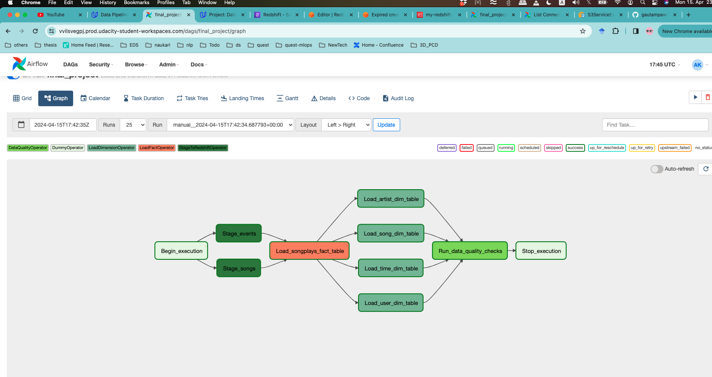
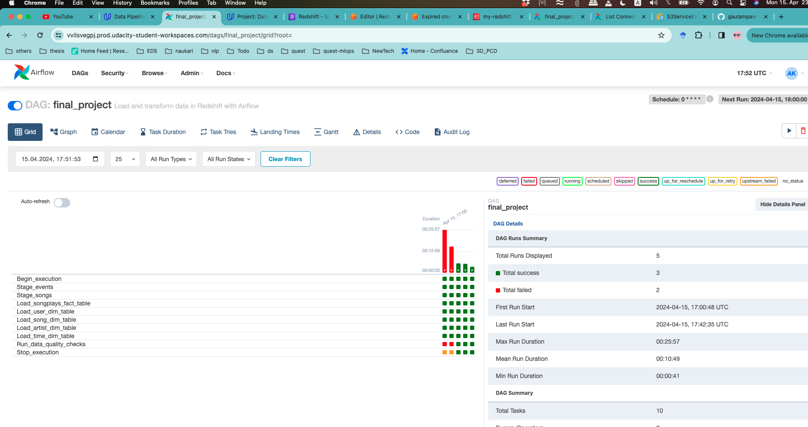

# Data Pipelines with Airflow

## Project Introduction 
A music streaming company, Sparkify, has decided that it is time to introduce more automation and monitoring to their data warehouse ETL pipelines and come to the conclusion that the best tool to achieve this is **Apache Airflow**.

They have decided to bring you into the project and expect you to create high grade data pipelines that are dynamic and built from reusable tasks, can be monitored, and allow easy backfills. They have also noted that the data quality plays a big part when analyses are executed on top the data warehouse and want to run tests against their datasets after the ETL steps have been executed to catch any discrepancies in the datasets.

The source data resides in **S3** and needs to be processed in Sparkify's data warehouse in **Amazon Redshift**. The source datasets consist of JSON logs that tell about user activity in the application and JSON metadata about the songs the users listen to.

### Datasets
* Log data: `s3://udacity-dend/log_data`
* Song data: `s3://udacity-dend/song_data`

### Tools used
* Python, SQL
* Apache Airflow
* Amazon Web Services (AWS IAM, S3, Redshift Serverless, CLI)


## Airflow Data pipeline 

### Copy S3 Data

* Create a project S3 bucket using the AWS Cloudshell

    ```sh
    aws s3 mb s3://final-bucket-v1/
    ```

* Copy the data from the udacity bucket to the home cloudshell directory: 

    ```sh
    aws s3 sync s3://udacity-dend/ s3://final-bucket-v1/
    ```

* List the data in bucket to be sure it copied over: 

    ```sh
    aws s3 ls s3://final-bucket-v1/log-data/
    aws s3 ls s3://final-bucket-v1/song-data/
    ```

### Airflow DAGs 

#### Operators 
* `Begin_execution` & `Stop_execution`

    Dummy operators representing DAG start and end point 
* `Create_tables`

    Create tables in Redshift
#### 2. `final_project` DAG overview



#### Operators 
* `Begin_execution` & `Stop_execution`

    Dummy operators representing DAG start and end point 
* `Stage_events` & `Stage_songs`

    Extract and Load data from S3 to Amazon Redshift
* `Load_songplays_fact_table` & `Load_*_dim_table`

    Load and Transform data from staging to fact and dimension tables
* `Run_data_quality_checks`

    Run data quality checks to ensure no empty tables

### Execution
1. Create S3 bucket and copy data from source
2. Set Up AWS and Airflow Configurations
3. Run `create_tables` DAG to create tables in Redshift
4. Run `finaly_project` DAG to trigger the ETL data pipeline

#### Successful DAG runs


